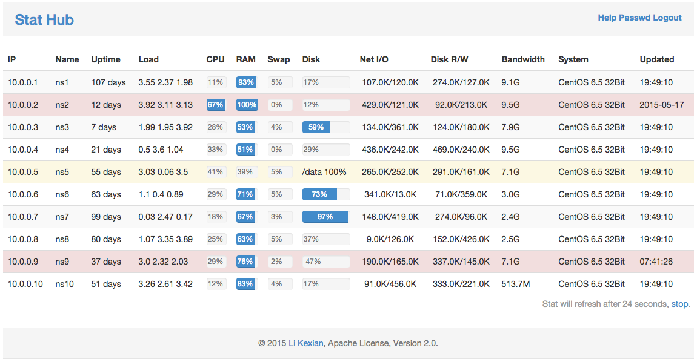

# Stat Hub

A smart Hub for holding server stat

[English README](README.md) | [中文说明](README-ZH.md)

## 总揽

Stat Hub 是一个帮您收集并展示众多服务器状态的服务。

它由两部分组成，一是服务端，用于接收、储存和展示状态；另一个是客户端，它用于收集并发送状态到服务端。而这一切，您只需要两个二进制文件。

## 演示

## 特性

- Go 语言编写
- 只需两个文件就可以完成一切
- 部署简单，没有依赖不需要数据库
- 支持SSL安全，支持域名访问，安全并简单

## 安装

请选择其中一台服务器做主服务器，并按以下说明在上面安装服务端。

### Linux (如果有curl)

    curl --insecure https://raw.githubusercontent.com/likexian/stathub-go/master/setup.sh | sh

### Linux (如果有wget)

    wget --no-check-certificate -O - https://raw.githubusercontent.com/likexian/stathub-go/master/setup.sh | sh

### 在您电脑的浏览器打开它

对于大多数系统，到这里服务已经成功安装并启动了，现在您可以通过本地电脑上的浏览器打开它。

默认URL是

    https://ip:15944

输入默认密码: likexian

### 添加一个客户端

按以下提示操作

    https://ip:15944/help

## FAQ

- 为什么页面上什么也没有？

    请先添加一个客户端，您可以参考一下帮助页面

- 我添加了一个客户端，还是没有数据显示？

    请在客户端查看 client.log 的内容看看出错原因。

- 我需要在服务端也运行 client 吗？

    当然要，服务端也同时是一个客户端。

- 我可以使用域名而不是 IP 访问页面吗？

    当然可以，请在域名解析中添加一条指向服务器端 IP 的 A 记录，然后用 https://子域名.域名:15944 访问即可。

- 我可以用 https 访问页面吗？

    没问题，并且SSL是默认启用的，不过用的是自签名证书。

- 我可以不用自签名证书，而是使用自己的有效证书吗？

    当然可以，并且强烈推荐这么做。请用您的证书替换掉 cert 目录里对应的文件。

- 我可以跟 nginx 一起部署吗？

    没问题，请将以下配置加到 nginx 配置文件。

    location /stathub/ {
        proxy_pass https://127.0.0.1:15944;
        proxy_set_header X-Real-IP $remote_addr;
    }

## 版权

Copyright 2015, Li Kexian

Apache License, Version 2.0

## 关于

- [Li Kexian](https://www.likexian.com/)

## 感谢

- [All stargazers](https://github.com/likexian/stathub-go/stargazers)
- [Livid](https://github.com/livid)
- [Septembers](https://github.com/Septembers)
- [Bluek404](https://github.com/Bluek404)
- [renjie45](https://github.com/renjie45)
- [vijaygadde](https://github.com/vijaygadde)
- [davoola](https://github.com/davoola)
