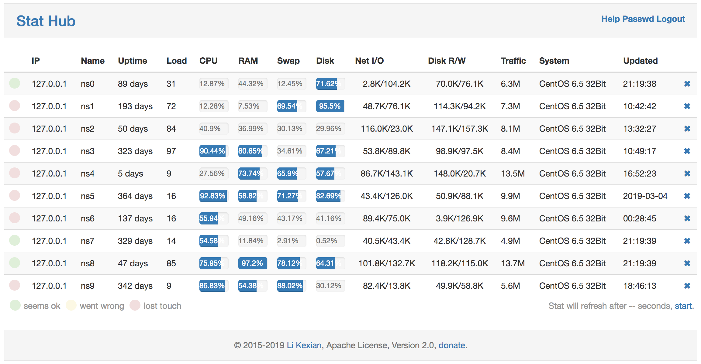

# Stat Hub

A smart Hub for holding server stat

[中文说明](README-ZH.md) | [English README](README.md)

## Overview

Stat Hub is a service for collecting and displaying servers stat.

Stat Hub have two parts, one is the SERVER for recving, storing and displaying stat, the other is the CLIENT for collecting and sending stat to SERVER. Just ONE binary files is needed for all of this.

## DEMO

## Feature

- Powered by Golang
- Only one binary files, collecting and displaying data
- Easy deploy, no depends, no database required
- SSL support, your domain support, secure and easy

## Install

You shall choose a server for master, and install it following the below

### Linux via curl

    curl --insecure https://raw.githubusercontent.com/likexian/stathub-go/master/setup.sh | sh

### Linux via wget

    wget --no-check-certificate -O - https://raw.githubusercontent.com/likexian/stathub-go/master/setup.sh | sh

### Open on your PC browser

For most systems, it will install and start after this, now you can view it via your PC browser.

The default url is

    https://ip:15944

Then enter the default password: likexian

### Add a CLIENT (node)

Follow the guide

    https://ip:15944/help

## FAQ

- A client added, but no list on the page ?

    Please refer to the client.log on the node, it may show what is wrong.

- Can I use my domain instead of the https://ip:15944 ?

    Yes, please add an A record on your dns server for one subdomain, then using https://subdomain.yourdomain:15944 .

- Can I use https for visist ?

    Sure, it is SSL by default, using self-signed cert.

- Cal I use my SSL cert, not the self-signed one ?

    Yes, please replace the cert in the cert dir, and it strong recommend that doing this.

- Can I deploy it with my nginx ?

Sure, please add the folling config to nginx conf file.

    location / {
        proxy_pass https://127.0.0.1:15944;
        proxy_set_header X-Real-IP $remote_addr;
    }

## Dependencies

- [github.com/likexian/daemon-go](https://github.com/likexian/daemon-go)
- [github.com/likexian/host-stat-go](https://github.com/likexian/host-stat-go)
- [github.com/likexian/logger-go](https://github.com/likexian/logger-go)
- [github.com/likexian/simplejson-go](https://github.com/likexian/simplejson-go)

## LICENSE

Copyright 2015-2019 Li Kexian

Licensed under the Apache License 2.0

## About

- [Li Kexian](https://www.likexian.com/)

## DONATE

- [Help me make perfect](https://www.likexian.com/donate/)
